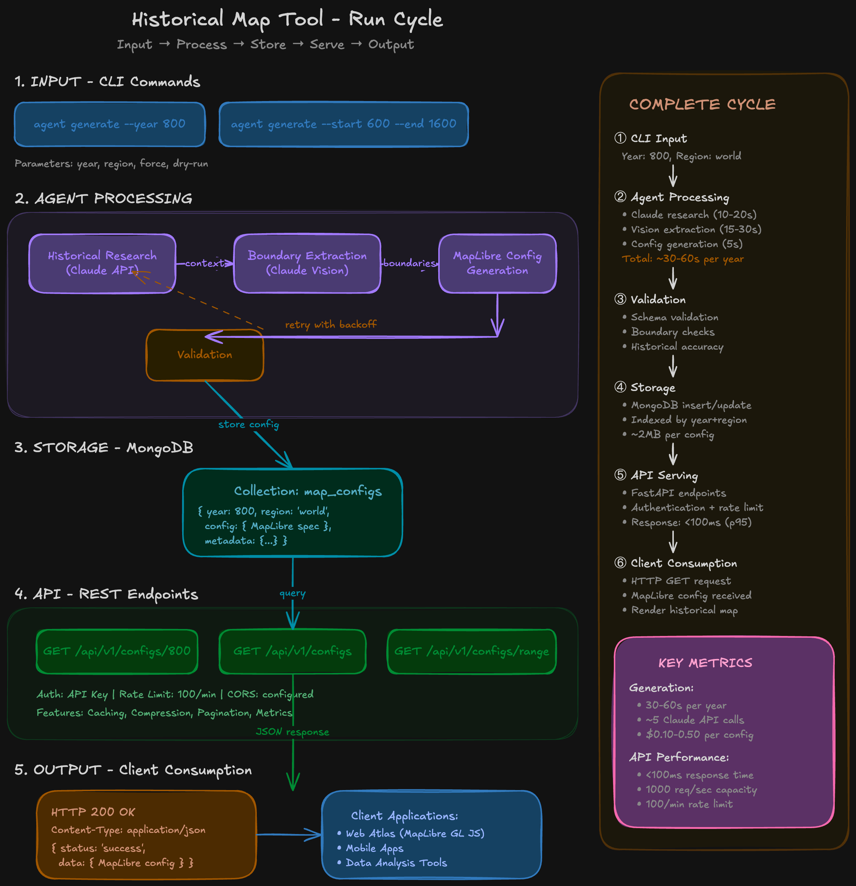

# atlas-fabric

Atlas Fabric started with a simple goal:

I wanted to build a historical atlas web app.

While researching, I realized something frustrating —
there is no complete, open, structured dataset of historical political borders over time.

Most historical maps exist as static images in books.
There is no public API that says:

"Give me the world borders in the year 800."

So instead of just building a map viewer, I decided to experiment with building the dataset itself.

AtlasFabric is that experiment.

---

## What Is AtlasFabric?

AtlasFabric is a temporal boundary generation engine.

It attempts to reconstruct historical political maps using:

- Open geographic base units (modern admin boundaries)
- Time-based entity modeling
- LLM-assisted classification
- Deterministic validation
- MapLibre-compatible output

It does not claim perfect historical accuracy.

It explores whether we can systematically build a usable historical boundary dataset when none publicly exists.

---

## Core Idea

Instead of manually drawing borders, AtlasFabric:

1. Uses open admin-level polygons as building blocks
2. Assigns those units to historical polities for a given year
3. Validates overlaps and structural consistency
4. Unions polygons into entity geometries
5. Generates MapLibre GL JS configurations
6. Stores results in a database
7. Serves them through a REST API

LLMs assist with classification.
Code enforces structure and validation.

---

## Why This Matters

There is no:

- Complete open historical border dataset
- Structured world boundary timeline
- Public historical territory API

AtlasFabric explores whether this gap can be filled using modern tooling and careful system design.

It is both a data experiment and an engineering experiment.

---

## Current Scope

AtlasFabric is experimental.

Initial goals:

- Support selected years
- Focus on major historical entities
- Store generation history
- Add confidence scoring
- Improve results over iterations

It is not trying to perfectly reconstruct every month of world history.

---

## System Architecture (Simplified)

AtlasFabric follows a simple cycle:

