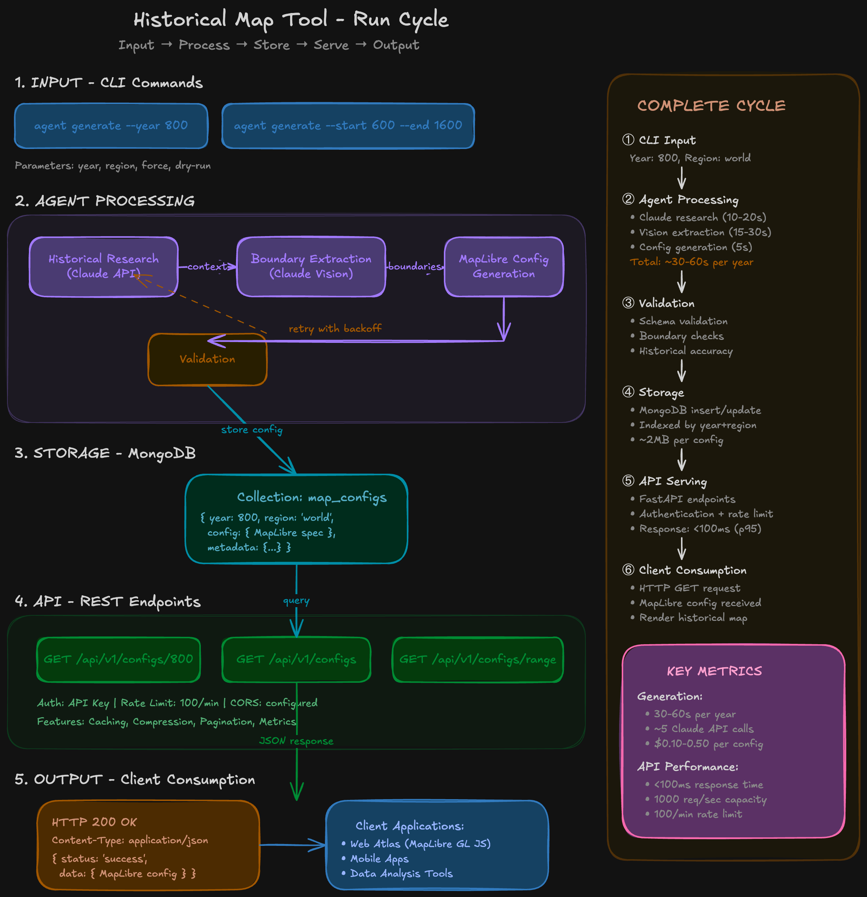

# atlas-fabric

Atlas Fabric started with a simple goal:

I wanted to build a historical atlas web app.

While researching, I realized something frustrating —
there is no complete, open, structured dataset of historical political borders over time.

Most historical maps exist as static images in books.
There is no public API that says:

"Give me the world borders in the year 800."

So instead of just building a map viewer, I decided to experiment with building the dataset itself.

AtlasFabric is that experiment.

---

## What Is AtlasFabric?

AtlasFabric is a temporal boundary generation engine.

It attempts to reconstruct historical political maps using:

- Open geographic base units (modern admin boundaries)
- Time-based entity modeling
- LLM-assisted classification
- Deterministic validation
- MapLibre-compatible output

It does not claim perfect historical accuracy.

It explores whether we can systematically build a usable historical boundary dataset when none publicly exists.

---

## Core Idea

Instead of manually drawing borders, AtlasFabric:

1. Uses open admin-level polygons as building blocks
2. Assigns those units to historical polities for a given year
3. Validates overlaps and structural consistency
4. Unions polygons into entity geometries
5. Generates MapLibre GL JS configurations
6. Stores results in a database
7. Serves them through a REST API

LLMs assist with classification.
Code enforces structure and validation.

---

## Why This Matters

There is no:

- Complete open historical border dataset
- Structured world boundary timeline
- Public historical territory API

AtlasFabric explores whether this gap can be filled using modern tooling and careful system design.

It is both a data experiment and an engineering experiment.

---

## Current Scope

AtlasFabric is experimental.

Initial goals:

- Support selected years
- Focus on major historical entities
- Store generation history
- Add confidence scoring
- Improve results over iterations

It is not trying to perfectly reconstruct every month of world history.

---

## System Architecture (Simplified)

AtlasFabric follows a simple cycle:



---

## What's Built

### Environment & Tooling
The project runs on Python 3.12 with a clean `make`-based workflow — `make setup` installs everything, `make generate` runs the pipeline, `make test-unit` runs tests with no external dependencies required.

### Geo Module
A set of pure functions that form the data backbone of the pipeline:

- **Loader** — reads Natural Earth admin-1 polygons (~4,600 worldwide) and filters them to a named region by centroid
- **Validator** — checks geometry validity, EPSG:4326 bounds, polygon type, and pairwise overlap between polity territories
- **Union** — groups polygons by polity assignment and merges them into a single unified geometry using `shapely.ops.unary_union`
- **Regions** — 11 named bounding boxes (world, europe, middle_east, east_asia, etc.)

### Knowledge Base
`knowledge/polities.json` seeds 25 historical entities with active date ranges, alternative names, and notes. The validator uses this to catch anachronisms — e.g. rejecting an "Ottoman Empire" assignment for year 800 — before any geometry is stored.

### Model Factory
`agents/model_factory.py` is the single place in the codebase that imports LLM provider classes. All agent code calls `get_model(role="generator")` and the provider is resolved entirely from environment variables at runtime:

```
GENERATOR_MODEL=anthropic/claude-opus-4-5
REVIEWER_MODEL=openai/gpt-4o
```

Supported: `anthropic`, `openai`, `google`, `ollama`, `groq`, `mistral`

### Generator Agent (LangGraph)
A `StateGraph` that runs a tool-calling loop with 10 tools in a defined sequence: check cache → estimate cost → load region bounds → query knowledge base → load polygons → research historical context → classify in batches of 50 → union geometries → validate → build MapLibre config.

### Reviewer Agent (LangGraph)
A separate adversarial agent running on a different model. It checks every polity for anachronisms, audits confidence scores, verifies coverage, and assesses geographic plausibility before issuing `approved`, `partial`, or `rejected`.

### Orchestrator
Wires generator → reviewer with up to 3 retries. Reviewer feedback is fed back into the generator's next attempt as a prompt. Config is only written to the database after the reviewer approves — never from the generator directly.

### REST API
FastAPI server with three config endpoints, `X-API-Key` authentication, and 100 req/min rate limiting via slowapi:

```
GET /api/v1/configs/{year}?region=europe
GET /api/v1/configs?region=europe&page=1&limit=20
GET /api/v1/configs/range?start=600&end=1600&region=europe
GET /health
```

### CLI
```bash
make generate ARGS="--year 800 --region europe"
make generate ARGS="--year 800 --region europe --dry-run"
```

---

## Quick Start

```bash
make setup
cp .env.example .env          # add your API key
# download ne_10m_admin_1_states_provinces.geojson → ./data/

make generate ARGS="--year 800 --region europe --dry-run"
make run-api
make test-unit
```

---

## Tech Stack

| | |
|---|---|
| Agent graphs | LangGraph 0.2+ |
| LLM abstraction | LangChain 0.3+ |
| LLM providers | Anthropic, OpenAI, Google, Ollama, Groq, Mistral |
| Geo | Shapely 2.0, GeoPandas |
| Database | Motor 3.6 (async MongoDB) |
| API | FastAPI 0.115 + uvicorn |
| CLI | Typer 0.13 |
| Validation | Pydantic v2 |

---

## Known Limitations

**Polygon granularity** — Natural Earth uses modern administrative boundaries. Historical polities rarely followed modern province lines. Every generated config includes this caveat in its `metadata.known_limitations` field.

**Knowledge base coverage** — Anachronism detection is only as accurate as the seed data in `polities.json`. Prioritise seeding the years you plan to generate first.

**Model tool-call reliability** — Not all models follow multi-step tool-calling instructions consistently. Test any new model with `--dry-run` before using it in production. Track results in `model_compatibility.md`.
